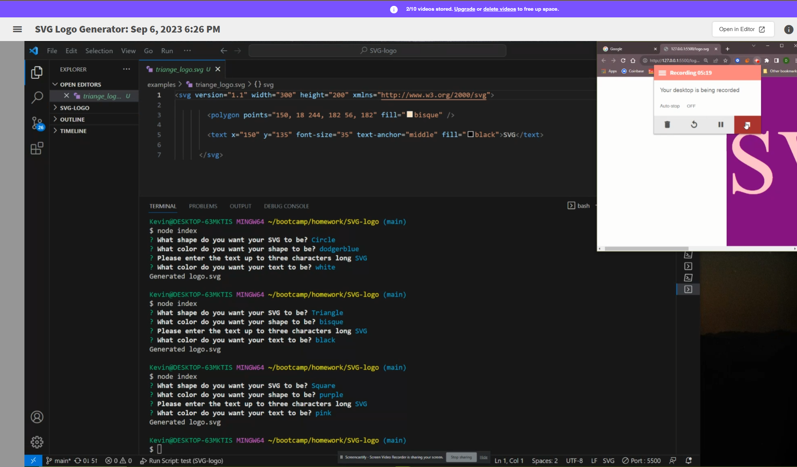

# SVG Logo Generator 


# Description
This project is to build a Node.js command-line application that takes in user input to generate a logo and save it as an SVG file. The application prompts the user to select a color and shape, provide text for the logo, and save the generated SVG to a svg file.

## Table of Contents
* [Installation](#installation)
* [Usage](#usage)
* [License](#license)
* [Contributing](#contributing)
* [Tests](#tests)
* [Questions](#questions)

## Installation
### The following dependencies required to run the application:
* [Jest](https://www.npmjs.com/package/jest)

* [Inquirer.js](https://www.npmjs.com/package/inquirer/v/8.2.4)

* [NodeJS](https://nodejs.org/en/download)

* **touch .gitignore**


## Usage
```bash
node index.js
```


 https://drive.google.com/file/d/1745QR6F13lWo42XuvGqWtj8pwAH3moX3/view
## License


## Contributing:
UCF Bootcamp Student Support


## Tests
```bash
node index.js
```
```bash
npm test
```

## Questions
For additional questions, reach out to me at the following below:
* Author: [Kevin Rice](https://app.slack.com/client/T056YAJ4MPF/D05D0V54751)
* GitHub: [DirtyRice901](https://github.com/DirtyRice901/)
* Email: reatriniti@gmail.com 

---
© 2023 edX Boot Camps LLC. Confidential and Proprietary. All Rights Reserved.
